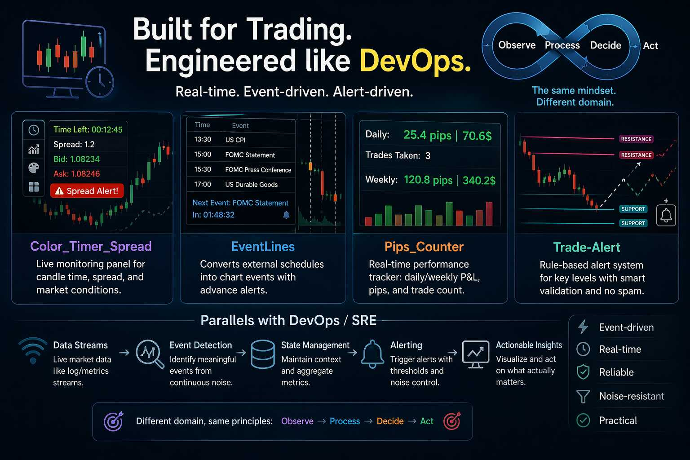
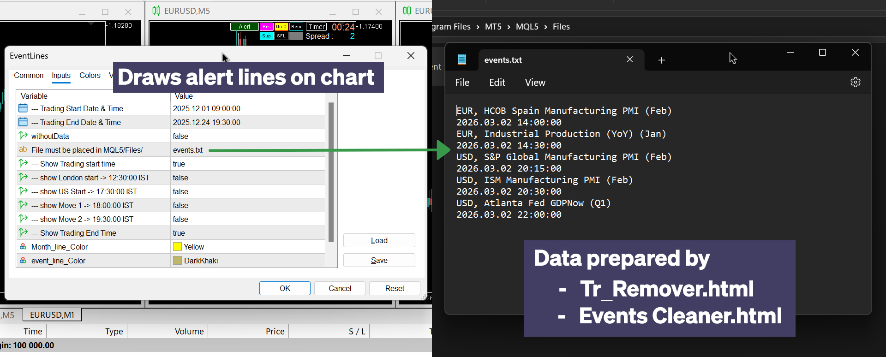
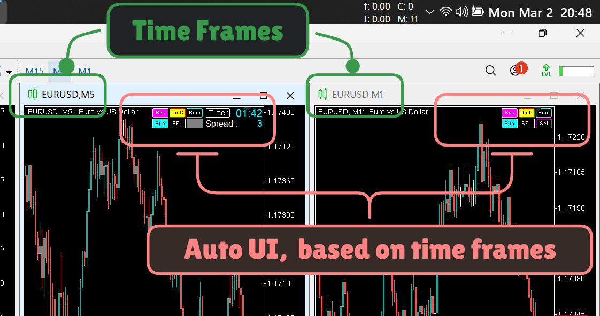
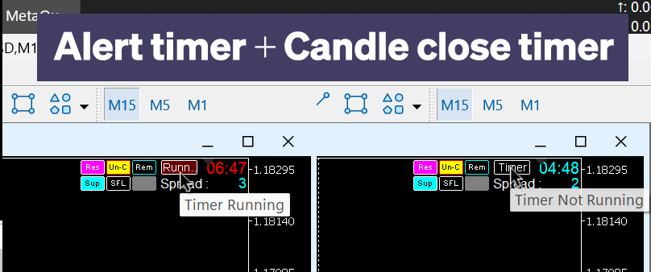
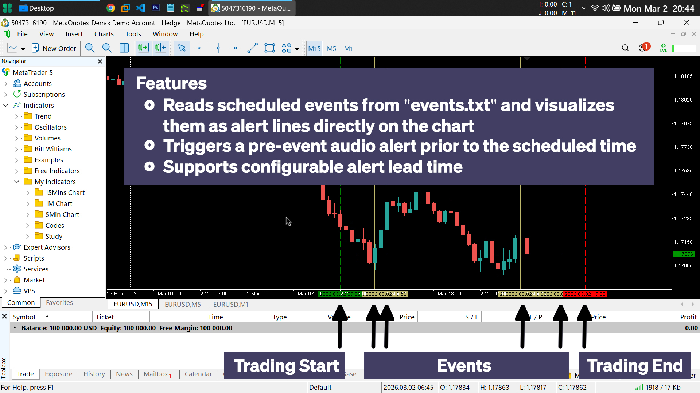
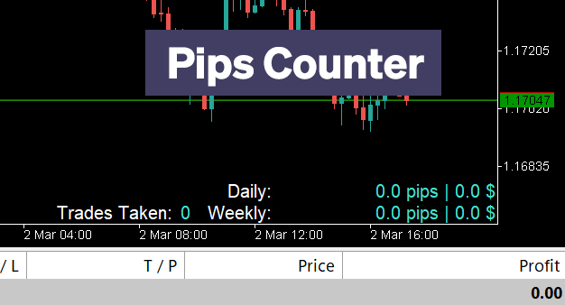
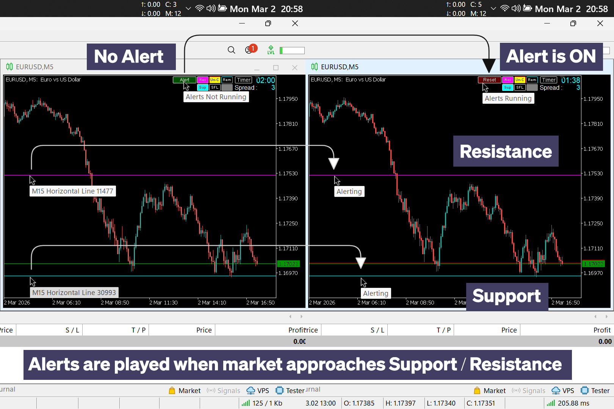

# MetaTrader 5 Custom Indicators (MQL5)

*Built a set of **`real-time, event-driven monitoring tools in MQL5`** to automate **`trading workflows, reduce manual intervention, and enforce decision discipline`**.*

*These systems process live market data streams, detect meaningful events, and trigger controlled alerts — **`applying engineering principles similar to observability, alerting, and event processing systems used in distributed environments`**.*

*Although developed for financial markets, this project demonstrates practical capabilities relevant to DevOps and automation engineering, including:*

- Real-time monitoring systems
- Event detection and processing
- Alerting pipelines with noise control
- Data aggregation and state tracking
- Operational guardrails and automation



## 📑 Table of Contents

- **[Overview](#-overview)**
- **[Architecture](#️-architecture)**
- **[Data Processors](#-data-processors)**
- **[Indicators](#-indicators)**
- **[Engineering Highlights](#️-key-engineering-highlights)**
- **[Challenges & Decisions](#-challenges--decisions)**
- **[Why This Matters for DevOps](#-why-this-project-matters-for-devops)**
- **[Author](#-author)**

## 📌 Overview

*This project consists of **`four custom indicators`** designed as real-time monitoring and alerting tools for trading environments.*

*Each indicator operates on live data, maintains internal state, and reacts to events — **`similar to how production systems monitor metrics, detect anomalies, and trigger alerts`**.*

Key capabilities demonstrated:

- Event-driven system design
- Real-time data processing
- Stateful monitoring and aggregation
- Alerting logic with controlled triggers
- Custom tooling for workflow automation

### Indicators

- **Color-timer-spread**\
    *Displays candle countdown timers, monitors spread conditions, and provides configurable alerts with visual feedback on charts.*
- **Event-lines**\
    *Converts external timing data into visual event markers with advance alerting for upcoming events.*
- **Pips-counter**\
    *Tracks daily and weekly performance metrics, including profit/loss and trade activity, using real-time aggregation.*
- **Trade-alert**\
    *Monitors key price levels and triggers intelligent alerts based on proximity, thresholds, and validation logic.*

## 🏗️ Architecture

*All indicators follow an **`event-driven architecture, similar to how monitoring and alerting systems operate in distributed environments`**.*

*Instead of running blindly, each component reacts to live market data, processes events, maintains state, and triggers actions only when conditions are met.*

- Key components:

    ```
    Market Data Stream
          ↓
    Event Processing Logic
          ↓
    State Tracking (in-memory)
          ↓
    Alert / UI Update
    ```

Design characteristics:

- **Reactive processing** → responds only to meaningful events
- **Stateful logic** → maintains context across ticks (e.g., thresholds, trade stats)
- **Controlled alerting** → avoids noise through validation and one-time triggers
- **Lightweight execution** → optimized for continuous real-time updates

This architecture closely resembles:

- Observability pipelines **(metrics → processing → alerting)**
- Monitoring systems **(event detection + response)**
Stream-processing systems

## 🧩 Data Processors

**How it works:**

- Raw data from investing.com:
    
- Processing by Data Processors:
    
- Final Output:
    
- **`Event-lines.mq5`** Reads the structured event data
    

To support the indicators, I built **lightweight JavaScript-based preprocessing tools** to clean, transform, and structure external data before feeding it into the system.

These tools act as a data ingestion and normalization layer, **similar to preprocessing steps in observability or ETL pipelines**.

### 1. Table Cleaner (Tr.js)

A filtering tool to **remove irrelevant or noisy data from raw HTML tables before processing**.

What it does:

- **Removes <tr> blocks based on keyword matching**
- **Supports case-sensitive and flexible filtering**
- **Generates a summary report of removed entries**
- **Outputs cleaned HTML for further processing**


Engineering relevance:

- **Noise reduction before data processing**
- **Keyword-based filtering (similar to log filtering rules)**
- **Data cleaning to improve downstream accuracy**

### 2. Event Processor (Events.js)

A utility designed to **extract and structure event data from raw HTML tables**.

What it does:

- **Parses unstructured HTML using DOM processing**
- **Extracts relevant fields (date, time, country, event name)**
- **Converts data into a standardized datetime format (YYYY.MM.DD HH:MM:SS)**
- **Filters events within a configurable time window**
- **Outputs clean, structured data for downstream consumption**


Engineering relevance:

- **Data normalization from inconsistent sources**
- **Time-based filtering (similar to log/event pipelines)**
- **Structured output generation for system compatibility**

### Why this matters

These processors ensure that **only clean, relevant, and structured data enters the system**.

This mirrors real-world DevOps workflows, where raw inputs (logs, metrics, events) must be:

- **Filtered**
- **Normalized**
- **Structured**

before they can be reliably processed by monitoring and alerting systems.

## 🧩 Indicators

### 1. Color-timer-spread.mq5

#### Purpose

A **real-time monitoring indicator** that provides time-sensitive and spread-related insights directly on the chart.

Acts like a **`live metrics panel`**, helping users react to short-term market conditions without manual tracking.



#### Key Features

- Displays **remaining time** for the current candle
- Candle close alert:
  - Toggle-based alert activation
  - Configurable lead time before close
    
- Spread alert system:
  - Triggers when threshold is exceeded
  - Visual (chart color change) + sound notification
  - Designed to quickly highlight abnormal conditions
- A dedicated color pallete to change the color of selected object on all open charts **(supporting "trade-alert.mq5" indicator)**
    
- Bid/Ask price visualization
- **Context-aware behavior:**
  - Disables unnecessary features on lower timeframes (M1)
  - Enables bulk object selection tools when needed

### 2️⃣ Event-lines.mq5

#### Purpose

A **time-based event visualization system** that converts external schedules into actionable chart markers.

Useful for **tracking predefined events, similar to how scheduled jobs or external signals are handled in production systems**.

#### Key Features

- Reads structured **event data from external files**
    
- Translates timestamps into chart-based event markers
    
- **Pre-event alerting system:**
  - Configurable lead time
  - Notifies before event occurrence
- **Fallback mechanism:**
  - Defaults to session timings if external data is unavailable
  - Ensures system reliability even with missing inputs

### 3️⃣ Pips-counter.mq5

#### Purpose

A **real-time performance monitoring system** that tracks trading activity and aggregates metrics directly on the chart.

Functions similarly to a **lightweight observability dashboard.**

#### Key Features

- **Tracks:**
  - Daily profit/loss (pips and monetary value)
  - Weekly aggregated performance
  - Number of trades executed
- **Event-based updates:**
  - Refreshes metrics only when trades close
  - Avoids unnecessary computation
- **Aggregation logic:**
  - Maintains rolling weekly statistics
  - Combines multiple trade outcomes into summarized metrics
- **Visual dashboard:**
  - Displays all metrics using structured chart labels
    

        ```
                        Daily:  25.4 pips |  70.6$
        Trades Taken: 3  Weekly: 120.8 pips | 340.2$
        ```

- **Integration support:**
  - Triggers external scripts for per day trade limits as reminder

### 4️⃣ Trade‑Alert

#### Purpose

An **intelligent alerting system** that monitors key price levels and triggers alerts based on proximity and validation rules.

Designed to act like a **rule-based monitoring system**, reducing unnecessary alerts while focusing on high-value signals.

#### Key Features

- **Interactive alert control via on-chart button**
- **Selective monitoring:**
  - Tracks only specific objects (horizontal lines with defined colors)
  - Uses color as a classification mechanism (Support / Resistance)
- **State-driven behavior:**
  - Toggles alert activation
  - Updates object metadata (tooltips, states)
    
- **Alert validation logic:**
  - Configurable sensitivity thresholds
  - Optional candle pattern confirmation before triggering
- **Noise reduction:**
  - One-time alert per level (prevents repeated triggers)
  - Focuses only on actionable conditions
- **Zone-based detection:**
  - Defines valid proximity range before alerting

## ⚙️ Key Engineering Highlights

- **Designed event-driven systems** reacting to live data instead of constant polling
- **Implemented stateful tracking** for real-time aggregation and context-aware decisions
- **Built noise-controlled alerting systems** using thresholds and one-time triggers
- **Developed data preprocessing tools** to clean, filter, and structure raw inputs before processing
- **Applied parsing and normalization logic** to handle unstructured external data
- **Optimized execution to ensure efficient performance** under continuous real-time conditions

## 🧠 Challenges & Decisions

This project was built as a small system, not isolated features — focused on processing data, maintaining context, and reacting to events reliably.

Key decisions:

- Prioritized **event-driven design** over unnecessary computation
- Separated data preprocessing (JS) from runtime logic (MQL5) for clarity and flexibility
- Focused on **signal over noise**, preventing alert spam through validation and trigger control
- Designed **fallback mechanisms** to handle missing or unreliable external data
- Ensured **consistent data formatting** to avoid downstream processing issues
- Built **solutions based on real needs**, avoiding unnecessary complexity

## 🚀 Why This Project Matters for DevOps

These indicators were built to **solve real operational challenges in a live trading environment**, where decisions depend on timely and accurate information.

They address problems such as:

- Monitoring rapidly changing conditions
- Tracking performance in real time
- Detecting meaningful events
- Triggering timely, actionable alerts

To support this, I also **built data preprocessing tools** to clean and structure external inputs before they enter the system — ensuring reliability and consistency across the pipeline.

The same principles directly apply to **DevOps and SRE environments**, where systems must:

- Ingest and process raw data (logs, metrics, events)
- Filter and normalize noisy or inconsistent inputs
- Detect anomalies or important signals
- Trigger reliable alerts with minimal false positives
- Maintain state for context-aware decision-making

This project demonstrates the ability to design end-to-end systems, including:

- Data ingestion and preprocessing
- Real-time event processing
- Stateful monitoring and aggregation
- Noise-controlled alerting mechanisms

All **operating on live data streams with intelligent, event-driven behavior** — a core requirement in modern production infrastructure.

## 👨‍💻 Author

This project reflects **my approach to system design** — `focusing on real-time processing, signal detection, and controlled automation`.

I aim to build systems that are **practical, reliable, and responsive**, applying the same mindset used in production monitoring, alerting, and automation workflows.
