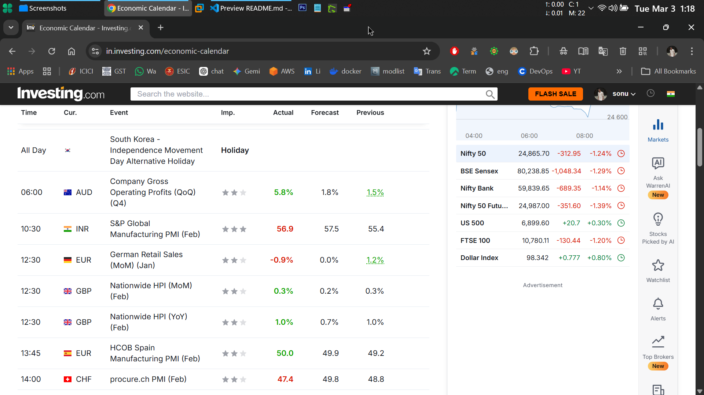
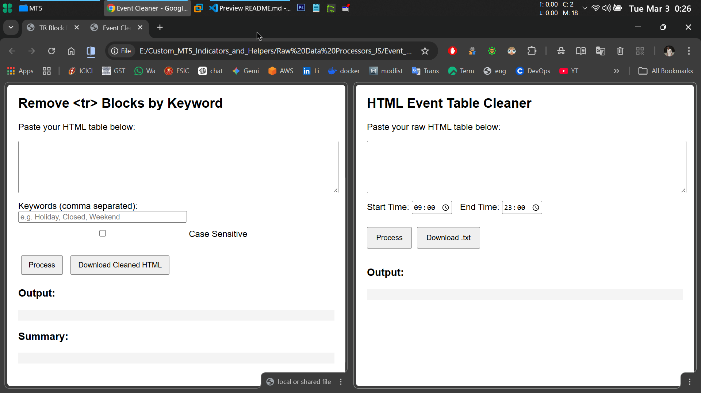
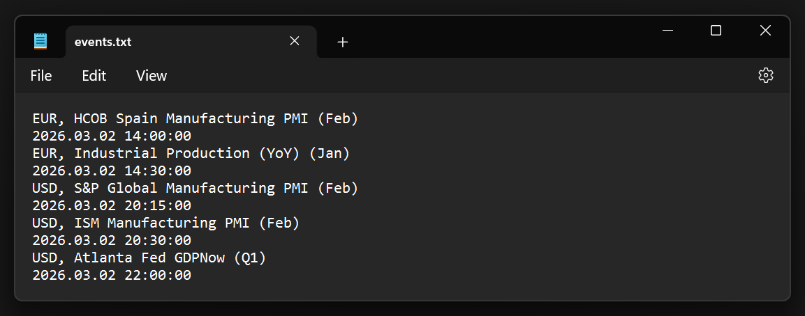

# Data Processing Utilities



Takes data from investing.com



Formats the data, so that `EventLines.ex5` can futher process it



This repository contains two lightweight browser-based utilities written
in **vanilla JavaScript** for processing and cleaning HTML tables.

The tools run entirely in the browser and require **no external
dependencies**, making them easy to use for quick data extraction and cleanup tasks.

---

# 1. Event Cleaner

## Overview

**Event Cleaner** processes a raw HTML table containing scheduled events
and converts it into a structured text format.

It extracts: - Event date - Event time - Country - Event name

It also allows filtering events within a **specific time range**.

## Key Features

- Paste raw HTML table data
- Automatically parse `<tr>` rows
- Detect and store event dates
- Extract event time, country, and event name
- Filter events using start and end time
- Format output into a clean readable structure
- Download processed results as `.txt`

## How It Works

### HTML Parsing

The script uses:

DOMParser()

to convert the pasted HTML string into a DOM document that can be
queried using JavaScript selectors.

### Row Processing

Each `<tr>` row is analyzed to determine whether it represents:

1.  **A date row**
2.  **An event row**

Date rows update the current working date.

Event rows extract: - Time - Country - Event name

### Time Filtering

Events are filtered using the selected time range.

The time is converted to **total minutes since midnight**:

eventMinutes = hours \* 60 + minutes

Only events within the user-defined range are kept.

### Date Formatting

The final output is formatted as:

YYYY.MM.DD HH:MM:SS

Example:

USA, Non‑Farm Payrolls 2026.03.02 20:30:00

### Output

The processed results are stored in memory and displayed in the
interface.

Users can download the results as:

events.txt

---

# 2. TR Block Remover

## Overview

**TR Block Remover** removes `<tr>` rows from an HTML table that contain
specific keywords.

It is useful for filtering unwanted rows such as:

- Holidays
- Market closures
- Weekends
- Any custom keywords

## Key Features

- Paste raw HTML table
- Remove rows containing specific keywords
- Optional **case-sensitive search**
- Displays cleaned HTML output
- Generates a keyword match report
- Download cleaned HTML file

## How It Works

### Keyword Processing

Users provide comma-separated keywords.

Example:

Holiday, Closed, Weekend

The script: 1. Splits keywords by comma 2. Trims whitespace 3. Removes
empty entries

### HTML Parsing

The HTML is parsed using:

DOMParser()

which converts the raw string into a queryable DOM.

### Row Scanning

Each `<tr>` row is scanned for keyword matches.

If a match is found:

- The entire row is removed
- The match counter is updated

### Case Sensitivity

Users can toggle case sensitivity.

If disabled, both row text and keywords are converted to lowercase
before comparison.

### Summary Report

After processing, the tool generates a summary showing:

- Total rows removed
- Keyword match counts

Example:

Total

```{=html}
<tr>
```

removed: 5

Keyword matches: "holiday" → 3 "weekend" → 2

### Output

The cleaned HTML is displayed and can be downloaded as:

cleaned_table.html

---

# Architecture

Both tools follow the same simple architecture:

User Input → DOM Parsing → Row Processing → Output Display → Download

This keeps the tools: - Fast - Lightweight - Easy to modify

---

# Technologies Used

- HTML5
- CSS
- Vanilla JavaScript
- DOMParser API
- Blob API for file downloads

No frameworks or external libraries are required.

---

# Use Cases

These tools are useful for:

- Cleaning scraped HTML tables
- Extracting structured event data
- Filtering unwanted rows
- Preparing data for automation pipelines
- Quick browser-based data processing

---

# Advantages

- Runs entirely in the browser
- No installation required
- No server dependency
- Lightweight and fast
- Easy to customize

---

# License

Free to use and modify.
